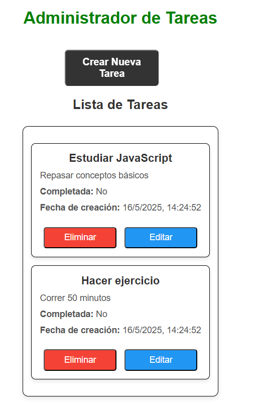
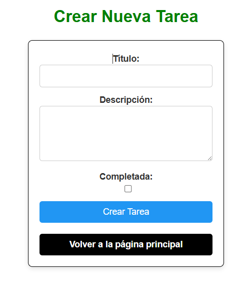
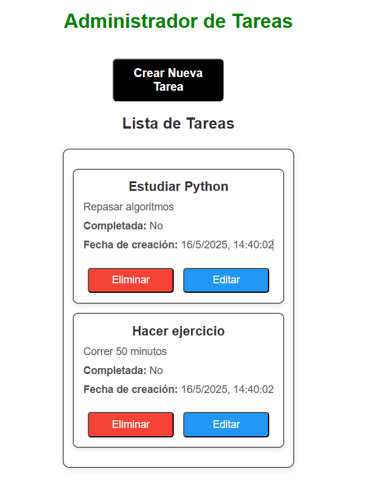
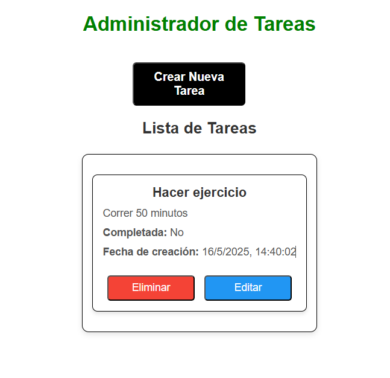

Ejecutar: git clone https://github.com/Ronaldvillan/adminTareas.git cd adminTareas
Configurar variables de entorno

Backend: verificar el archivo .env en backend/ con: PORT=5000
Asegurarse que el puerto 5000 esté libre.

Si cambia el puerto, actualizar también la URL en frontend/.env.
Frontend: crear archivo .env en frontend/ con: VITE_API_URL=http://localhost:5000/api

Cambiar el puerto en esta URL si el backend corre en otro.

Instalar dependencias
Backend: cd backend npm install npm install dotenv # importante para variables de entorno
Frontend: cd ../frontend npm install

Levantar el proyecto

Backend (desde backend/): node server.js
Debería mostrar: Servidor corriendo en el puerto 5000
Frontend (desde frontend/): npm run dev

Abrir la URL que muestra la terminal (normalmente http://localhost:5173/)
Uso

Probar la aplicación en el navegador y verificar que se comunique correctamente con el backend.
Confirmar que listar, crear y editar tareas funcione bien.
Imagenes del funcionamiento de la app para una mejor comprensión:

imagenes del funcionamiento de la app

🏠 Página principal  

➕ Crear nueva tarea  

✏️ Tarea editada  

🗑️ Tarea eliminada  
